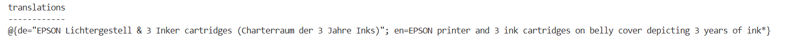

# Azure Container Apps — Deployment Guide

## Overview

This app generates alt text for product images using Azure OpenAI (Phi-4-multimodal-instruct) and optionally translates it into multiple languages. It runs as a plain Flask web app inside a Docker container on Azure Container Apps.

The container_app.py uses SLM to translate while alt_translate use Azure Translation Service to translate

---

## Architecture

| Component | Role |
|---|---|
| **Flask** | Web framework — defines HTTP routes, parses requests, returns JSON responses |
| **Gunicorn** | Production WSGI server — handles concurrency, worker management, socket binding |
| **Docker** | Packages the app into a portable container image |
| **Azure Container Registry (ACR)** | Stores the container image |
| **Azure Container Apps (ACA)** | Runs the container, manages scaling, networking, and ingress |
| **User-Assigned Managed Identity** | Authenticates the app to ACR (image pull) and Azure OpenAI (API calls) |

---

## Deployment Steps

### 1. Set Variables (bash / Git Bash)

```bash
export RESOURCE_GROUP="<your-rg-name>"
export ENVIRONMENT="<your-container-env-name>"
export CONTAINER_APP_NAME="<your-container-app-name>"
export REGISTRY_NAME="<your-container-registry-name>"
export IDENTITY_NAME="<your-user-id-name>"
export MSYS_NO_PATHCONV=1  # Required for Git Bash on Windows
```

### 2. Create User-Assigned Managed Identity

```bash
az identity create \
  --name $IDENTITY_NAME \
  --resource-group $RESOURCE_GROUP
```

### 3. Assign AcrPull Role to the Identity

Below is not required as this is done when you assign user identity to ACR

```bash
IDENTITY_RESOURCE_ID=$(az identity show --name $IDENTITY_NAME --resource-group $RESOURCE_GROUP --query id -o tsv)
IDENTITY_CLIENT_ID=$(az identity show --name $IDENTITY_NAME --resource-group $RESOURCE_GROUP --query clientId -o tsv)

az role assignment create \
  --assignee $IDENTITY_CLIENT_ID \
  --role AcrPull \
  --scope $(az acr show --name $REGISTRY_NAME --query id -o tsv)
```

### 4. Assign Cognitive Services Role to the Identity

```bash
az role assignment create \
  --assignee $IDENTITY_CLIENT_ID \
  --role "Cognitive Services User" \
  --scope "/subscriptions/<sub-id>/resourceGroups/<openai-rg>/providers/Microsoft.CognitiveServices/accounts/<your-foundry-account>"
```

### 5. Build and Push the Image (Remote Build on ACR)

```bash
cd Azure-Container-Apps

az acr build \
  -t $REGISTRY_NAME".azurecr.io/alt-text-app:v1" \
  -r $REGISTRY_NAME \
  -f Dockerfile .
```

> This builds remotely on ACR — no local Docker installation required.

### 6. Create Container App

```bash
az containerapp create \
  --name $CONTAINER_APP_NAME \
  --resource-group $RESOURCE_GROUP \
  --environment $ENVIRONMENT \
  --image $REGISTRY_NAME".azurecr.io/alt-text-app:v1" \
  --target-port 8080 \
  --ingress external \
  --user-assigned $IDENTITY_RESOURCE_ID \
  --registry-identity $IDENTITY_RESOURCE_ID \
  --registry-server $REGISTRY_NAME.azurecr.io \
  --query properties.configuration.ingress.fqdn
```

### 7. Set Environment Variables

```bash
az containerapp update \
  --name $CONTAINER_APP_NAME \
  --resource-group $RESOURCE_GROUP \
  --set-env-vars \
    ENDPOINT_URL="<your-foundry-url>" \
    DEPLOYMENT_NAME="Phi-4-multimodal-instruct" \
    API_VERSION="2024-05-01-preview" \
    ALT_TEXT_PROMPT_PATH="/app/system_prompt.txt" \
    AZURE_CLIENT_ID="$IDENTITY_CLIENT_ID" \
    TRANSLATOR_ENDPOINT="https://api.cognitive.microsofttranslator.com/" \
    TRANSLATOR_REGION="<region_name>" \
    TRANSLATOR_RESOURCE_ID="/subscriptions/<sub_id>/resourceGroups/<RG_NAME>/providers/Microsoft.CognitiveServices/accounts/<Service_Name>"
```

### 8. Test

```powershell
Invoke-RestMethod -Method POST -Uri "https://<your-app-fqdn>/alt-text" ` #or alt-translate based on which app
  -ContentType "application/json" `
  -Body '{"image_url": "https://example.com/image.jpg", "target_language_codes": ["de", "es"]}'
```

---

## Issues Encountered & Fixes

### 1. Git Bash Mangled Azure Resource IDs

**Error:** Resource ID prefixed with `c:/program files/git/subscriptions/...`

**Cause:** Git Bash on Windows converts paths starting with `/` to local file paths.

**Fix:** Set the environment variable before running commands:
```bash
export MSYS_NO_PATHCONV=1
```

### 2. DefaultAzureCredential Failed to Get Token

**Error:** `DefaultAzureCredential failed to retrieve a token from the included credentials`

**Cause:** Multiple managed identities may exist; `DefaultAzureCredential` doesn't know which one to use.

**Fix:** Set `AZURE_CLIENT_ID` environment variable to the managed identity's **client ID**:
```bash
az containerapp update \
  --name $CONTAINER_APP_NAME \
  --resource-group $RESOURCE_GROUP \
  --set-env-vars AZURE_CLIENT_ID="<client-id>"
```

### 3. curl Not Working in PowerShell / cmd

**Error:** `Invalid JSON payload` or `'img404' is not recognized`.

**Cause:** `&` in URLs is interpreted as a command separator. PowerShell `curl` is an alias for `Invoke-WebRequest`.

**Fix:** Use `Invoke-RestMethod` in PowerShell, or `curl.exe` with escaped quotes. In cmd, escape `&` as `^&`.

---

## Things to Keep in Mind

1. **`MSYS_NO_PATHCONV=1`** — Always set this in Git Bash on Windows before running `az` commands with resource IDs.

2. **`AZURE_CLIENT_ID`** — Required when using user-assigned managed identity so `DefaultAzureCredential` knows which identity to use.

3. **Port 8080** — Dockerfile, gunicorn, and ACA ingress `--target-port` must all match.

4. **`system_prompt.txt`** — Must be in the same folder as the Dockerfile so `COPY . .` includes it in the image. Set `ALT_TEXT_PROMPT_PATH=/app/system_prompt.txt`.

5. **Role assignments** — The managed identity needs:
   - `AcrPull` on the Container Registry
   - `Cognitive Services OpenAI User` on the Azure OpenAI resource

6. **Rebuilding** — After code changes, rebuild and push a new image tag, then update the container app:
   ```bash
   az acr build -t $REGISTRY_NAME".azurecr.io/alt-text-app:v2" -r $REGISTRY_NAME -f Dockerfile .
   az containerapp update --name $CONTAINER_APP_NAME --resource-group $RESOURCE_GROUP --image $REGISTRY_NAME".azurecr.io/alt-text-app:v2"
   ```

7. **Logs** — Check container logs for debugging:
   ```bash
   az containerapp logs show --name $CONTAINER_APP_NAME --resource-group $RESOURCE_GROUP --type console --follow
   ```

8. **No Azure Functions runtime** — This is a plain Flask app, not Azure Functions. There is no `function.json`, no bindings, no triggers — just HTTP routes served by Flask + Gunicorn.

9. **In internal subscriptions, use the Security tag**

## Results

```bash
$results = Invoke-RestMethod -Method POST -Uri "https://<cont-app-name>.<region-name>.azurecontainerapps.io/alt-text" `
  -ContentType "application/json" `
  -Body '{"image_url": "https://i8.amplience.net/i/epsonemear/a17839-productpicture-hires-nl-nl-et-1810-1_header_2000x2000?fmt=auto&img404=missing_product&v=1", "target_language_codes": ["de"]}'
```

