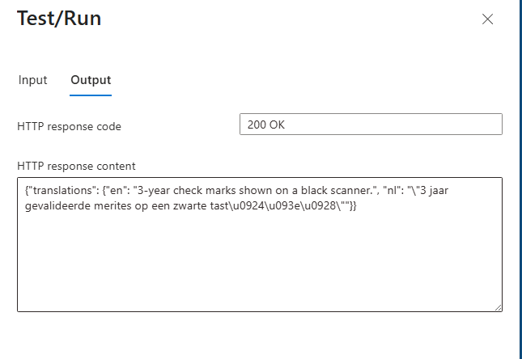

# Troubleshooting Summary

This document captures the issues encountered while deploying and testing the Azure Function and how each was resolved.

## Issues and Resolutions

- Function not visible ("no HTTP trigger found")
  - Cause: Python version 3.14 not supported yet in Flex plan especially with auto build. [github issue documented here](https://github.com/Azure/azure-functions-python-worker/issues/1801)
  - Fix: Switched to version 3.13.8. You cannot change version in Flex so deployed again

- Token expired or auth failures
  - Cause: Managed identity not configured correctly or wrong client ID.
  - Fix: Attach the user-assigned identity to the Function App, set AZURE_CLIENT_ID to the identity's Client ID (not Object ID), then restart the app. Client id was misspelled in the settings

- No Kudu on Flex Consumption
  - Cause: Flex Consumption does not provide Kudu.
  - Fix: Use Log Stream and Application Insights for diagnostics.

- CORS error when testing in Azure Portal
  - Cause: Portal origin blocked by CORS.
  - Fix: Add https://portal.azure.com to CORS for portal testing.

- 500 error and missing prompt file
  - Cause: Windows file path used on Linux (D:\home\site\wwwroot\system_prompt.txt).
  - Fix: Use /home/site/wwwroot/system_prompt.txt or remove ALT_TEXT_PROMPT_PATH to use the packaged file. I removed the ALT_TEXT_PROMPT_PATH from app settings

- DefaultAzureCredential failed (no identity found)
  - Cause: Identity not attached or not targeted by AZURE_CLIENT_ID.
  - Fix: Reattach identity, set AZURE_CLIENT_ID to the correct Client ID, then restart. Client id was misspelled in the settings

- Foundry project access not sufficient
  - Cause: Role assigned only on Foundry project.
  - Fix: Assign **Cognitive Services User** on the Azure AI Services resource. Not the project but the resource

## Useful Checks

- Verify Application Settings in the Function App:
  - ENDPOINT_URL
  - DEPLOYMENT_NAME
  - API_VERSION
  - AZURE_CLIENT_ID

- If you are on Flex Consumption, enable Application Insights to persist logs.

## Test Results

### Portal



### PowerShell

```powershell
$translations = Invoke-WebRequest `
  -Method Post `
  -Uri "https://func-app-name.azurewebsites.net/api/alt-text?code={your_code}" `
  -ContentType "application/json" `
  -Body '{
    "image_url": "https://i8.amplience.net/i/epsonemear/a17839-productpicture-hires-nl-nl-et-1810-1_header_2000x2000?fmt=auto&img404=missing_product&v=1",
    "target_language_codes": ["nl", "de"]
  }' `
  -UseBasicParsing
```

```
StatusCode        : 200
StatusDescription : OK
Content           : {"translations": {"en": "Desktop Epson printer with three monthly ink refills.", "nl": "\"Desktekprinters-Mammo deur drie maandelijke inktheresurgroepen.\"", "de": "\"Desktop-Ezpron     
                    Drucker mit drei m...
RawContent        : HTTP/1.1 200 OK
                    Transfer-Encoding: chunked
                    Request-Context: appId=cid-v1:28f1fcfb-5c7a-423e-b1f1-3c4dea760e33
                    Content-Type: application/json
                    Date: Thu, 12 Feb 2026 15:34:26 GMT
                    Server: Kestrel
                    ...
Forms             :
Headers           : {[Transfer-Encoding, chunked], [Request-Context, appId=cid-v1:28f1fcfb-a-423e1f1-3c4e33], [Content-Type, application/json], [Date, Thu, 12 Feb 2026 15:34:26 GMT]...}
Images            : {}
InputFields       : {}
Links             : {}
ParsedHtml        :
RawContentLength  : 237

$parsed = $translations.Content | ConvertFrom-Json
$parsed.nl
"Blauw Ethernet-router, inclusief drie BPA-vrije Epson inkjet-familie dynamische magenta printer spools"
```